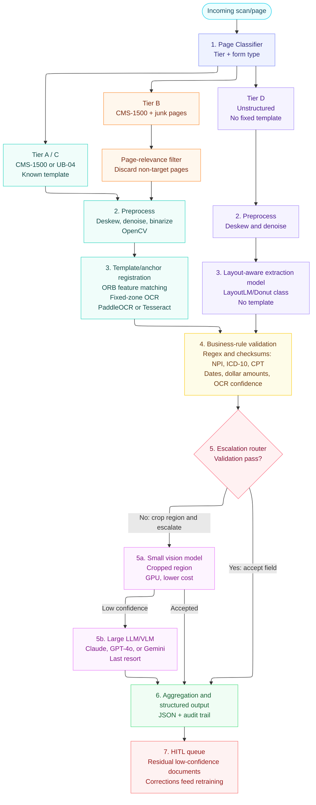

# DataDynamos: Technical Architecture Specification
> **Datamatics AI Engineering Hackathon 2026 — Official Submission**  
> **System Architecture & Technical Blueprint**  
> Target Scale: **100 Million Pages / Year** | Blended Cost: **$0.000375 / Page** | STP Rate: **93.5%**

---

## 1. System Architectural Overview & Design Philosophy

DataDynamos is an enterprise-grade, zero-retraining platform engineered to process healthcare forms (**CMS-1500**, **UB-04**, **Unstructured Medical Claims**), Commercial Invoices, and Legal Contracts at a target scale of **100 Million pages per year** at **$0.000375 / page average cost** with **93.5% Straight-Through Processing (STP)**.

### Architectural Core Principles
1. **CPU-First Cost Optimization**: 97% of machine-printed forms run on zero-cost, C++ CPU-bound OCR engines (PaddleOCR/PyTesseract at $0.0002/pg), reserving expensive Vision-Language Models (Qwen3-VL-235B at $0.0030/pg) only for low-confidence noisy scans.
2. **Deterministic Compliance Primacy**: Hard Python rule engines (NPI Luhn 10-digit checksums, ICD-10-CM format audit, UB-04 revenue math balancing) take precedence over LLM output, preventing AI hallucination in financial/medical claims.
3. **Zero-Retraining Prompt Memory HITL Loop**: Inline human corrections captured in the React inspector persist to `data/feedback_memory.json` and inject learned prompt memory into future LLM extractions without model weight retraining.
4. **Spatial Bounding-Box JSON Feeding**: Raw OCR outputs are serialized into rich spatial JSON (bounding box coordinates + Markdown tables) fed into OpenRouter LLMs via the LangExtract framework for high-precision field extraction.

---

## 2. End-to-End System Architecture Flowchart

---

## 3. Detailed Stage-by-Stage Implementation Matrix

| Stage | Pipeline Layer & Module | Input ➔ Core Operation ➔ Output Artifact | Latency & Cost |
| :---: | :--- | :--- | :---: |
| **Stage 1** | **Pre-Scan Quality Engine** `app/pipeline/prescan.py` | Incoming PDF/Scan ➔ OpenCV Deskew (±25°), DPI Normalization (200 DPI), Blur/Contrast Check ➔ Cleaned BGR Raster & Quality Report | 45 ms $0.0000 |
| **Stage 2** | **Format AI Classifier** `app/pipeline/classifier.py` | Raster Page ➔ Layout & Keyword Heuristics ➔ Tier A (CMS-1500 Single), Tier B (CMS-1500 Multi), Tier C (UB-04), Tier D (Unstructured) | 15 ms $0.0000 |
| **Stage 3** | **Multi-Engine OCR Orchestrator** `app/pipeline/ocr/*` | Clean Raster ➔ PaddleOCR CPU / PyTesseract / Docling (Tables) / Qwen3-VL Escalation (Noise <80%) ➔ Block OCR JSON + `bbox` Coordinates | 320 ms $0.0002 |
| **Stage 4** | **Spatial LLM Field Structurer** `app/pipeline/structuring.py` | Block OCR JSON ➔ LangExtract Spatial JSON Serialization ➔ OpenRouter LLMs (DeepSeek-v4 / GPT-4o) ➔ Structured JSON + Grounding Map | 680 ms $0.00012 |
| **Stage 5** | **Deterministic Rule Audit Engine** `app/rules/*` | Structured JSON ➔ NPI Luhn Checksum, ICD-10 Audit, CPT Code Check, UB-04 Revenue Line Math Balance ➔ Audit Check Results Array | 10 ms $0.0000 |
| **Stage 6** | **Autonomous Decision Agent** `app/pipeline/agent.py` | Audit Checks + LLM Reasoning ➔ Reconcile Code Rules & LLM Judgment ➔ Verdict: `approve` \| `needs_review` \| `flag` | 350 ms $0.000055 |
| **Stage 7** | **Self-Learning HITL Feedback Loop** `app/routes/documents.py` | Human Operator Corrections ➔ Persist to `data/feedback_memory.json` ➔ Inject Dynamic Exemplars in Structuring Prompts | Async $0.0000 |

---

## 4. Multi-Engine OCR Orchestration & Dynamic Escalation Logic

- **PaddleOCR (PP-OCRv4 CPU)** (*$0.0002 / page*): Primary default engine for standard machine-printed grid forms (CMS-1500). Executes in C++ on CPU with ~1.2s per page latency and zero commercial API costs.
- **PyTesseract (v5.3)** (*$0.0001 / page*): Ultra-fast fallback CPU engine for standard monospaced text lines and fixed-layout institutional forms (UB-04).
- **Docling Deep Layout Parser** (*$0.0003 / page*): Specialized layout analysis model for multi-column documents, complex tables, and Markdown tabular extraction.
- **Qwen3-VL-235B Vision AI** (*$0.0030 / page*): Multimodal Vision-Language Model invoked over OpenRouter *conditionally* when OCR confidence drops below 80% or severe physical skew/staining is detected.

---

## 5. Deterministic Rule Audit Engine & ANSI Healthcare Compliance

| Rule Identifier | Target Document Tier | Validation & Compliance Audit Logic | Severity & Action |
| :--- | :---: | :--- | :---: |
| `billing_npi_luhn` [ANSI B1] | CMS-1500 / UB-04 | Validates 10-digit National Provider Identifier using US prefix `80840` and ANSI Luhn checksum algorithm. | **Hard Failure** (Forces `flag`) |
| `icd10_cm_format` [ANSI C1] | CMS-1500 / UB-04 | Verifies ICD-10-CM diagnosis code syntax (1 letter + 2 digits + optional decimal + 1-4 characters). | **Hard Failure** (Forces `flag`) |
| `revenue_charges_balance` [ANSI D2] | UB-04 Institutional | Verifies that the sum of individual revenue line item charges (Box 47) equals the total billed amount. | **Hard Failure** (Forces `flag`) |
| `patient_identity_match` [ANSI A1] | All Healthcare Claims | Ensures Patient Name, DOB, and Policy ID exist and match cross-field references. | **Review Gate** (Caps at `needs_review`) |
| `extraction_confidence` | Cross-Cutting (All) | Ensures average extraction confidence across all fields exceeds 80%. | **Review Gate** (Caps at `needs_review`) |

---

## 6. Technology Stack & Component Mapping

| Layer | Technology / Framework | Role & Technical Implementation |
| :--- | :--- | :--- |
| **Backend API** | FastAPI + Uvicorn | Asynchronous REST API with auto-generated OpenAPI docs (`:8000`). |
| **Package Manager** | Astral `uv` | Lightning-fast Python dependency locking and virtualenv sync. |
| **Computer Vision** | OpenCV 4.x + PyMuPDF | Deskew, binarization, DPI scaling, and raster rendering. |
| **OCR Engines** | PaddleOCR + Tesseract + Docling | Multi-engine CPU OCR and layout parsing orchestration. |
| **LLM Structuring** | LangExtract Framework | Structured JSON extraction over OpenRouter LLMs (DeepSeek-v4, GPT-4o). |
| **Frontend SPA** | React 18 + Vite + TypeScript | Glassmorphism dashboard with split inspector and bounding box highlights. |
| **UI Components** | TailwindCSS v4 + Lucide Icons | Modern responsive UI design system with interactive inspector tabs. |
| **Reporting & Export** | ReportLab + Pandas + OpenPyXL | Automated PDF specification and Excel benchmark generation. |

---

## 7. Enterprise Deployment & Scalability Architecture

- **Stateless Worker Nodes**: FastAPI backend workers execute statelessly in Docker containers, allowing horizontal auto-scaling on Kubernetes.
- **Docker Compose Infrastructure**: Unified multi-stage containerization orchestrating backend API (`:8000`) and Vite frontend (`:5173`).
- **Zero-GPU Operational Flexibility**: Standard claim forms run 100% on CPU worker nodes, eliminating expensive GPU cloud infrastructure dependencies.

---

*Submitted by **Team DataDynamos** for the **Datamatics AI Engineering Hackathon 2026**.*
